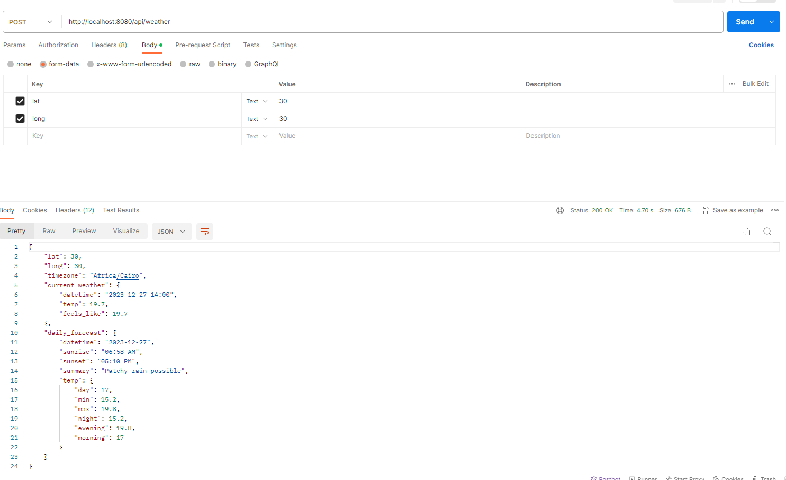

## POKRETANJE PROJEKTA

```
docker-compose build
docker-compose up -d 

cp app/.env.example app/.env
docker compose run --rm app composer install
docker-compose run --rm app php artisan config:cache
docker compose run --rm app php artisan key:generate
```

Aplikacija ce biti otvorena na adresi:
```
http://localhost:8080
```

### API ruta
```
POST http://localhost:8080/weather
BODY params
- lat
- long
```



### Weather API

U projektu je koriscen Weather API(https://www.weatherapi.com/) jer Open Weather nema besplatnu verziju servisa bez nekog subscription paketa koji nude, pa je ovo korisceno kao alternativa.

API key koji treba da se doda za ovaj servis u .env je : 

```
WEATHER_API_KEY='f32d3a9bda6c4b33ad5123150232612'
```

